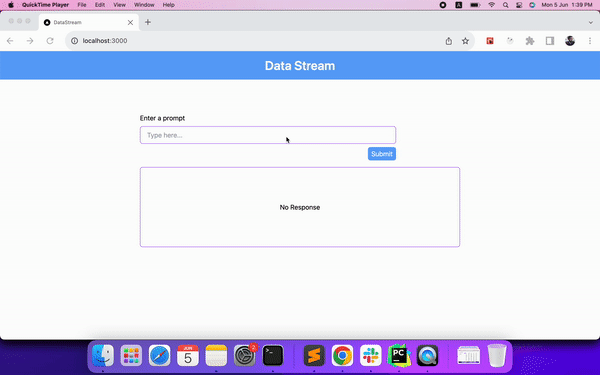

# Data Stream

  

To serve a better user experience, it is best to serve the text generated by the OpenAI completion model, as soon as it is generated. Sometimes when the response generated by the model is too long, returning the whole response at once can take sometime.

In this project, we will see how we can stream the response to the client as soon as it is generated.

## Pre-requisite

1. OpenAI API Key

## Steps to run this project

1. Clone the repo
2. Run `npm install` to install all the dependencies
3. Create a `.env.local` from `env-example` file: `cp env-example .env.local`
4. Update the OpenAI key in the `.env.local` file
5. Run `npm run dev` to start the project

## Tech Stack
- NextJS
- TailwindCSS
- OpenAI

## Contact

mohdejazsiddiqui@gmail.com